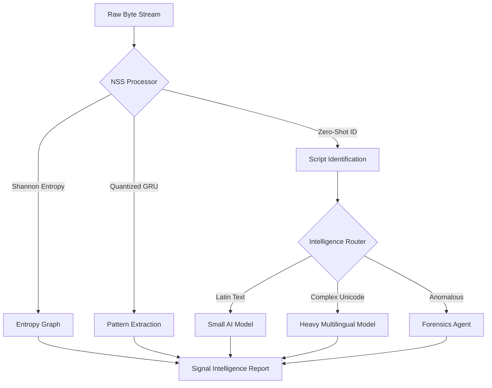

# 🌌 NSS Engine: Signal Intelligence Platform (v2.0)

[](https://www.python.org/)
[](https://fastapi.tiangolo.com/)
[](https://pytorch.org/)
[](https://build.nvidia.com/)

> **"One level higher than the noise."**  
> Transform raw byte streams into high-density intelligence using Neural Entropy Analysis and Zero-Shot Script Identification.

---

## 🛰️ Overview
The **NSS Engine (Neural Signal Sifter)** is a next-generation **Signal Intelligence Platform (SIP)** designed to solve the "Data Dilution Problem." In an era of expensive AI compute, the NSS Engine acts as a mission-critical gateway—stripping away 60-80% of low-entropy background noise while extracting dense signal patches for AI reconstruction.

Whether you are performing **Cyber-Forensics**, **Multilingual Data Ingestion**, or **Edge AI Optimization**, the NSS Engine identifies the "needle in the haystack" with zero-shot precision.

---

## ⚡ Key Features

### 🧠 Intelligence Layer
- **Neural Entropy Core**: High-resolution Shannon entropy analysis per 16-byte window.
- **Zero-Shot Script ID**: Automatically identifies scripts (Bengali, Cyrillic, Latin, etc.) using byte-range statistics—no dictionaries required.
- **Intelligence Routing**: Context-aware AI analysis that routes signals to specialized models based on detected script type.

### 🛡️ Cyber-Forensics
- **Anomaly Heatmapping**: Real-time visualization of suspicious entropy shifts (possible payload injections or steganography).
- **Neural Security Profiler**: SOC-grade risk assessment (Clean Text, Suspected Obfuscation, Data Leak).
- **Dynamic Spike Detection**: Moves with the file's baseline to detect transitions in even the densest Unicode streams.

### 🚀 Performance & Ops
- **WebSocket Live Streaming**: High-throughput real-time monitoring for live network traffic or data feeds.
- **Quantized GRU**: PyTorch-based Gated Recurrent Units running in `int8` precision for 4x memory efficiency.
- **Cyber-Aesthetic UI**: A premium, low-latency dashboard designed for dark-mode environments.

---

## 🛠️ Architecture



---

## 🚀 Setup & Installation

### 1. Clone the Intelligence Core
```bash
git clone https://github.com/Rajibur-Alvi/Stitch_nss_engine_analytics_dashboard.git
cd stitch_nss_engine_analytics_dashboard
```

### 2. Prepare the Environment
```bash
pip install -r requirements.txt
```

### 3. Configure AI Co-Processor (Optional)
To enable **AI Signal Reconstruction**, set your NVIDIA API Key:
```bash
# Windows
set NVIDIA_API_KEY=your_key_here

# Linux/macOS
export NVIDIA_API_KEY=your_key_here
```

### 4. Ignite the Engine
```bash
# Launch via Python
python main.py

# Or use the Windows Bootstrap
run_dashboard.bat
```

---

## 📡 Usage Guide

1. **Ingest**: Drag and drop raw data into the **Ingest Hub** or plug in a **Live WebSocket Stream**.
2. **Monitor**: Track the **Byte Surprise Index** and look for **Purple Anomaly Markers**.
3. **Analyze**: Review the **Neural Security Profile** and run **AI Reconstruction** on high-entropy patches.
4. **Export**: Generate high-density intelligence reports for downstream processing.

---

## 🤝 Target Audience
- **Cybersecurity Researchers**: For identifying hidden payloads.
- **AI Data Engineers**: For reducing token costs in LLM pipelines.
- **Forensics Analysts**: For script identification in unstructured binary blobs.

---
*Developed for high-efficiency Signal Intelligence.*
